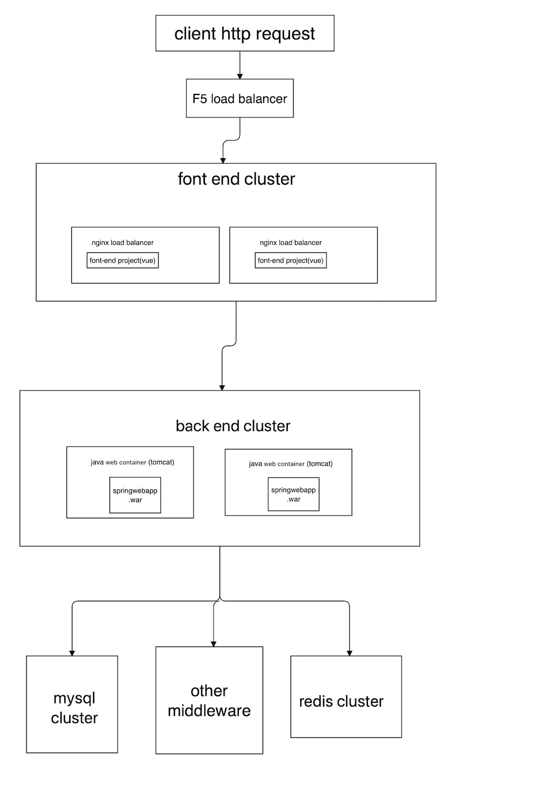

# 如何搭建一个高可用的Java Web系统

## 整体架构介绍
one java web system consist of java back-end project and font-end project and DB as well as other middleware(e.g ramDB,mq,mircoservice middleware)
I worked as a software engineer in China for 4 years.Now I want to share some experience. Even through it may not be exactly correct both in my essay and my english lol.
let's assume that we have a vey simple architecture. how do we develop it to a highly available system
### simple architecture：
At first, we should achieve this simple architecture.

#### first part----  [Font-End And Load Balancer](files/mdfile/english/font_end.md)
